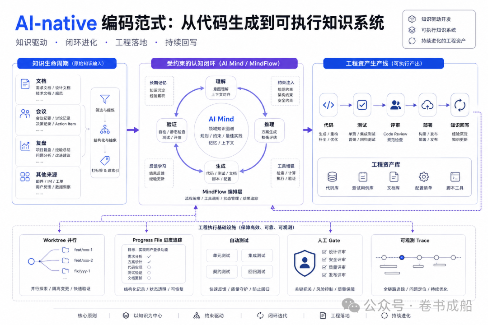
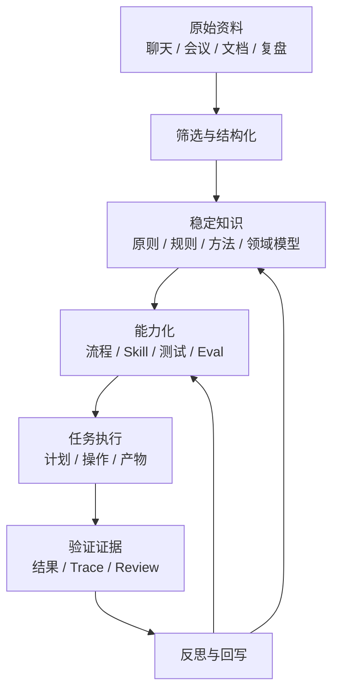
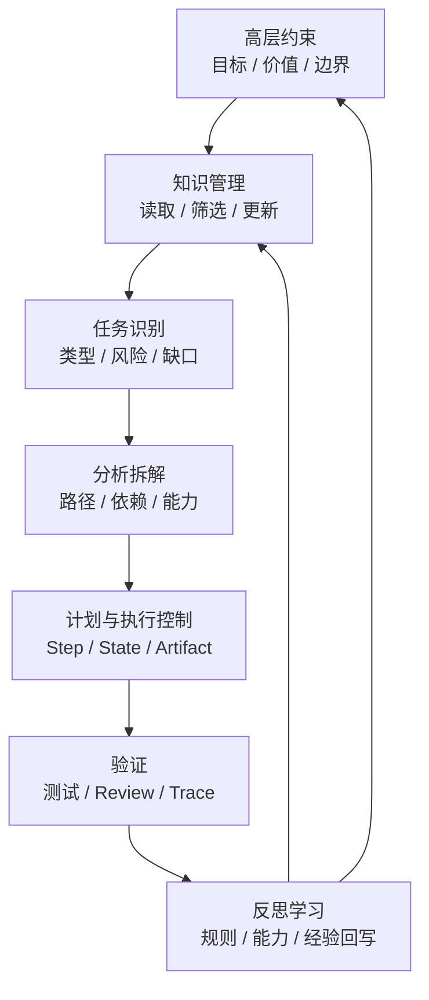
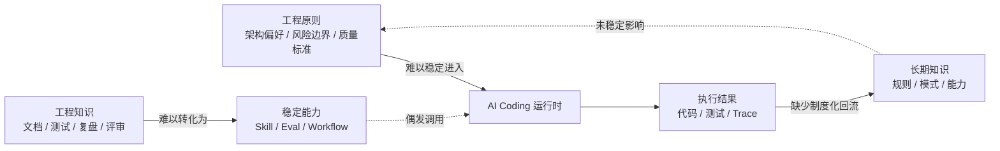
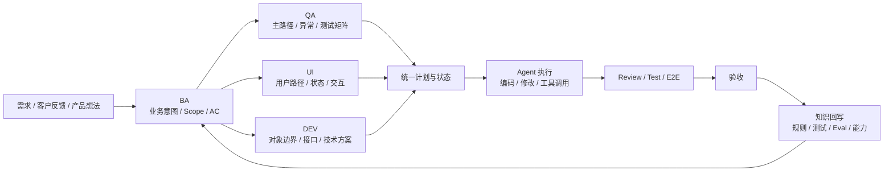
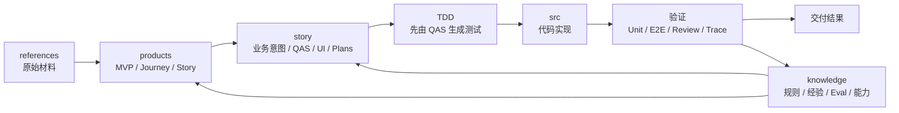
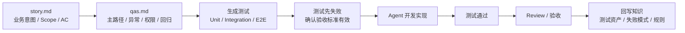
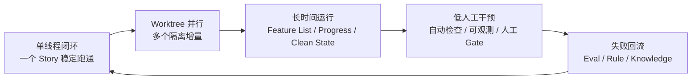
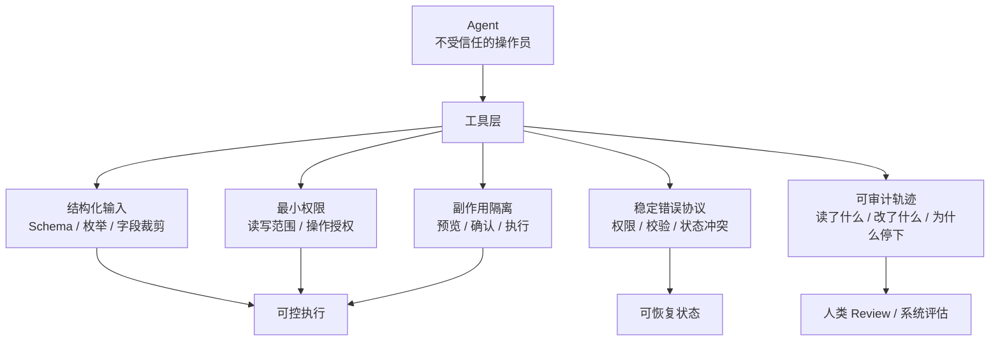

先放总览图：



很多人谈 AI，第一反应是模型能力。

模型能不能写代码，能不能做分析，能不能规划任务，能不能调用工具。这些问题当然重要，但如果只从模型能力看 AI，很容易忽略一个更底层的问题：人类真正交给 AI 的，不只是任务，而是一整套知识。

这些知识可能是业务背景、行业经验、工作方法、判断标准、历史材料、失败教训，也可能是一个团队长期形成的偏好、边界和协作方式。AI 要想稳定地产生价值，不能只会回答问题，还必须能在这些知识中工作。

这就是我现在越来越关注知识工程的原因。

知识工程不是把资料堆起来，也不是把 prompt 写长。它真正要解决的是：知识如何被组织，如何被读取，如何被验证，如何进入执行，如何在执行之后被更新。

如果知识只存在于人的脑子里、会议纪要里、聊天记录里、临时文档里，AI 就只能在碎片中猜。如果知识被组织成有边界、有权威关系、有状态、有验证、有回写机制的系统，AI 才能沿着它持续工作。

## 知识工程的核心：让知识进入执行

很多组织并不缺资料。它们有文档，有会议记录，有项目复盘，有培训材料，有流程规范，有各种历史产物。但资料多，并不等于知识工程做得好。

资料回答的是“东西在哪里”。知识工程回答的是另一组问题：什么是当前事实？谁可以修改？什么时候读取？怎么验证？如何更新？更新之后怎样影响下一次执行？

这一区别在 AI 时代非常关键。

人类面对混乱资料时，还能依赖经验判断。某份文档虽然没更新，但团队知道它已经过期；某条规则虽然只写在聊天里，但大家知道它才是最新决定；某个流程虽然没有正式写入规范，但老同事知道实际应该怎么做。

AI 没有这种默认语境。它会读取能看到的材料，然后做一个看似合理的综合。一旦权威关系混乱，综合越流畅，风险越隐蔽。

所以，AI-native 知识工程的目标，不是让 AI 读到更多材料，而是让它在正确阶段读取正确知识，并且让执行结果重新回到知识系统。

可以把这个过程理解为一个知识生命周期：



知识不是静态仓库。知识要能被筛选、被能力化、被执行、被验证，并在执行之后被更新。

如果没有这条链路，AI 每次任务都像从零开始。它可以很聪明，但系统不会变聪明。

## 一套 AI-native 的知识工程方法论应该解决什么

如果知识要进入执行，系统就不能只靠一次对话。

一次对话可以完成一次问答，也可以完成一个局部任务。但它很难稳定承载长期原则、组织偏好、历史经验、能力沉淀、当前状态和未来演进。任务越复杂，临时 prompt 越容易变成知识垃圾场：长期原则、当前目标、历史讨论、临时约束混在一起，每一段都像重要信息，但谁更权威并不清楚。

因此，一套 AI-native 的知识工程方法论至少要把能力划分成几个大块，并让它们协作起来。

第一块，是高层约束。系统必须知道什么是好结果，哪些方法被偏好，哪些边界不能越过，哪些风险必须停下来请求确认。这一层不是普通提示词，而是系统长期稳定的方向来源。

第二块，是知识管理。系统要知道哪些知识是正式的，哪些只是候选材料；哪些需要读取，哪些已经过期；哪些经验应该进入长期知识，哪些只属于当前任务。

第三块，是任务识别与分析。复杂任务不能一进来就执行。系统要先判断任务类型、复杂度、风险、知识缺口和能力需求，再决定后续路径。

第四块，是计划与执行控制。计划不是 todo list，而是执行协议：目标是什么，步骤如何拆，哪些产物必须生成，哪些状态必须记录，哪些条件满足才算进入下一步。

第五块，是验证与反思。任务结束不是把结果交出去就完了，而是要判断这次任务产生了什么新知识：哪些规则要更新，哪些测试要增加，哪些失败模式要沉淀，哪些能力要补足。

这几个能力块组合起来，才构成一个能够长期工作的 AI 系统。



我做了一个实践产品，叫 **MindFlow**，就是把这套方法论工程化。

MindFlow 地址：[https://github.com/neil-wang-global/MindFlow](https://github.com/neil-wang-global/MindFlow)

相关论文：[https://zenodo.org/records/18977748](https://zenodo.org/records/18977748)

MindFlow 的目标不是做一个“更会聊天”的 Agent，也不是给 Agent 加一组固定步骤。它试图解决的是：一个 AI 系统如何在长期原则约束下读取知识、识别任务、分析路径、执行计划、记录状态、反思结果，并把经验沉淀回知识与能力。

在 MindFlow 中，任务开始时不是直接执行，而是先读取正式知识。这个动作的价值，是把长期原则和已批准知识纳入当前任务的起点。随后任务进入识别、分析和计划生成。计划描述的不只是要做什么，还包括步骤边界、能力需求、并行方式、产物位置和完成条件。

执行阶段围绕计划和状态推进。每个 step 都携带输入、输出、完成条件和失败回流。任务中断时，状态文件告诉下一轮从哪里接手；任务偏离时，计划和状态暴露偏离的位置；任务完成时，产物和验证记录提供证据。

任务结束后，反思不是写一段总结，而是把执行结果重新纳入知识系统。哪些知识缺口被发现，哪些规则需要更新，哪些失败模式需要沉淀，哪些能力需要补足，都会进入后续学习和能力更新。

这就是 MindFlow 背后的核心判断：AI 系统要想长期可靠地工作，不能只依赖临场推理，而要有稳定的知识生命周期和能力沉淀机制。

## 软件本身也是知识

上面讲的是一般意义上的知识工程。但如果把视角放回软件工程，会发现同一套逻辑同样成立，甚至更加典型。

软件本身就是知识的可执行形态。

业务判断被写进分支逻辑，领域概念被沉淀为对象模型，架构约束进入模块边界，正确性判断进入测试用例，团队经验进入规范、脚手架、评审意见和发布流程。一个软件系统能运行，是因为这些知识被组织成了可执行结构。

过去，人是知识和代码之间的主要转换器。人读需求，理解背景，回忆历史约束，判断技术路径，然后把这些理解翻译成代码。

AI coding 改变的是这条转换链。

模型可以直接阅读文档、解释代码、调用工具、生成测试、修复错误。知识不再只是人在编码前消化的背景材料，而是开始进入执行过程本身。谁是当前事实，哪个规则有效，哪个测试代表验收标准，哪个计划描述下一步路径，这些问题会直接影响 AI 的行为。

所以，AI-native 软件工程的核心，不是“模型更会写代码”，而是软件工程中的知识开始变得可执行、可验证、可回写。

这也解释了为什么很多团队用了 AI 之后会同时感到兴奋和不安。模型确实更快了，但混乱也更快了。需求没有澄清完，它已经开始实现；边界没有固定，它已经补了默认假设；测试没有设计，它已经宣布完成。代码出现得更早，问题也更早进入系统。

真正的问题不是 AI 会不会写，而是软件知识能不能进入 AI 的执行过程。

## AI coding 的三个断裂

把知识工程放进软件场景，可以看到 AI coding 里最常见的三个断裂。

第一类断裂，是高层工程原则进不了运行时。团队知道自己偏好什么样的设计，知道哪些风险不能碰，知道什么算好结果，也知道某些业务判断为什么重要。但这些东西往往停留在人的经验、会议共识、历史讨论或零散文档里。Agent 真正执行任务时，读到的可能只是一个局部需求和一堆文件。

第二类断裂，是工程知识很难稳定转化为能力。一次事故复盘写完了，下一次同类问题是否能自动触发检查？一次测试遗漏暴露了，下一次开卡时是否会进入验收标准？一个架构约束被确认了，后续 Agent 是否会稳定遵守？如果答案是否定的，知识就只是存档，还没有变成执行能力。

第三类断裂，是执行结果难以回流学习。任务完成后，代码可能合并了，测试可能通过了，但这次任务中暴露的新规则、新失败模式、新业务边界，经常没有进入长期知识系统。下一次换一个人或换一个 Agent，又要重新解释一遍。



AI-native coding 要解决的，正是这三类断裂。

## AI coding 工作系统如何串起来

真正落到 AI coding，问题就变成：怎样把需求、角色、知识、代码、测试、评审、自动化和回写串成一条线？

这条线不能从“让 Agent 写代码”开始，而要从需求进入开始。

一个需求进入系统时，通常还不是工程任务。它可能是一句业务诉求、一段客户反馈、一个产品想法，里面混着目标、假设、边界和风险。第一步是任务化：把模糊输入变成可执行、可验证、可分派的任务结构。

任务化之后，BA 视角把业务意图、用户路径、验收标准和明确不做的范围拆出来。QA 视角在开卡阶段就进入，把主路径、异常路径、权限状态、边界条件和回归风险写成可验证的测试思路。UI 视角如果相关，则把用户路径转化为页面、交互状态、空态、错态和反馈机制。DEV 视角再基于这些内容设计对象边界、接口契约、数据结构、错误处理和实现路径。

这些判断最终要落到仓库里的状态和产物上，而不是停留在对话里。



可以把项目仓库理解为一条资产生产线：



更具体一点，目录结构可以长这样：

```text
project-repo/
├─ CLAUDE.md
├─ references/
│  ├─ chats/
│  ├─ meeting-minutes/
│  └─ wips/
├─ products/
│  └─ mvp-001/
│     └─ user-journey-001/
│        └─ story-001/
│           ├─ story.md
│           ├─ qas.md
│           ├─ ui.md
│           └─ plans/
│              ├─ plan.md
│              ├─ frontend-plan.md
│              ├─ backend-plan.md
│              ├─ api-contract.md
│              ├─ review.md
│              └─ progress.md
├─ src/
│  ├─ frontend/
│  └─ backend/
├─ agents/
│  ├─ orchestrator.md
│  └─ skills/
└─ knowledge/
   ├─ soul/
   ├─ qas/
   ├─ uis/
   ├─ domains/
   ├─ architectures/
   ├─ frontends/
   ├─ backends/
   └─ deliveries/
```

`references/` 是输入矿石，承接客户聊天、会议纪要、临时分析和阶段性材料。它不直接等于稳定知识，而是后续拆解的原料。很多团队的问题，是把原始材料、阶段性判断和最终结论混在一起。人还能靠记忆判断哪一份可信，Agent 很难。

`knowledge/` 是固定知识资产，也是项目知识的最新态。它应该承担单一权威来源的角色：领域规则、架构约束、QA 策略、UI 规范、交付经验，最终都要在这里形成稳定版本。对 Agent 来说，权威来源越分散，越容易把旧判断、新讨论和临时假设混在一起；只有把当前事实收束到一个稳定位置，后续执行才有共同基准。

`products/` 承载产品拆解，但它不是最终知识库。更准确地说，`products/` 是围绕某个 MVP、用户旅程或 story 形成的 knowledge diff。它有点像 SDD 框架里的 spec 拆解：把一次业务变化拆成 story、QAS、UI、计划、接口契约和进度状态，用来描述这次增量相对于当前 `knowledge/` 要改变什么、验证什么、交付什么。

所以，`products/` 的价值在于组织变化，`knowledge/` 的价值在于沉淀变化。一个 story 完成之后，不应该只把代码合进去，还要把被验证过的业务判断、测试场景、失败模式、架构约束和交付经验合并回 `knowledge/`。长期来看，真正有复利的是 `knowledge/`，因为它代表系统当前知道什么；`products/` 则是每次增量进入系统之前的工作台和变更记录。

这里我会把 `qas.md` 和 `story.md` 放在同一层。QAS 不是泛泛的 QA 说明，而是测试用例和验收场景。它应该在开卡阶段就和 story 一起出现。换句话说，一个 story 在进入开发之前，就应该同时回答两件事：用户要什么，以及如何证明它真的被实现了。

这会直接改变开发阶段的顺序。开发不是先让 Agent 写代码，再让 QA 补测试；而是先让 Agent 根据 QAS 生成测试用例，再进入实现。也就是 TDD。

TDD 在 AI coding 里非常重要。它不是一种老派仪式，而是给 Agent 设置可执行的验收标准。`Test` 是 `Development` 的边界：测试先定义什么叫正确，开发再围绕这个标准让测试通过。如果没有测试先行，Agent 很容易用一个看起来合理的实现替代真实需求；如果 QAS 先变成测试，Agent 的自由度就会被正确地收束到验收标准内。



`plans/` 是执行控制台。`plan.md` 管总路径，`frontend-plan.md` 和 `backend-plan.md` 分别给前后端 Agent 读取，`api-contract.md` 固定协作契约，`review.md` 保存评审结论，`progress.md` 记录当前状态、阻塞点和下一步。它的作用不是“写计划给人看”，而是让任务中断后能恢复，让不同 Agent 接手时知道自己该读什么。

`src/` 应尽量保持代码产物的纯粹。代码当然是核心产物，但它不应该吞掉业务背景、测试意图和状态记录。`agents/` 放编排器和角色技能，定义 Agent 如何进入流程、读取哪些文件、产出哪些结果。

这套结构不是为了复杂而复杂，而是为了让每个角色知道自己该读什么、产出什么、做到哪里、如何验收、怎么接手。

一个前端 Agent 不应该只读一句“实现页面”，它应该读 `story.md`、`qas.md`、`ui.md`、`frontend-plan.md`、`api-contract.md`。一个后端 Agent 不应该只读一句“实现接口”，它应该读 `story.md`、`qas.md`、`backend-plan.md`、`api-contract.md`、领域知识和测试要求。QA 不应该在最后补洞，而应该从开卡阶段就把 QAS 变成 Dev 的执行标准。Review 也不只是看代码风格，而是检查实现是否符合 story、QAS、plan、contract 和测试证据。

这样，需求不是直接流向代码，而是先变成 story、QAS、设计、计划和状态，再由 QAS 生成测试，再进入实现，最后通过验收和回写进入知识资产。

真正的完成，也就不再是 Agent 说“我完成了”。真正的完成是业务路径能走通，测试证据存在，评审风险处理完，状态文件更新，新的业务判断、失败模式或测试经验进入知识库、规则、技能或 eval case。

## 自动化不是跳过流程，而是复制稳定闭环

很多人谈无人值守开发，会想象把需求丢给 Agent，第二天代码自己出来。这个想象很危险。低人工干预的前提不是“没人管”，而是流程、状态、验证和权限足够清楚。

自动化的第一步不是并行，也不是长时间运行，而是单线程闭环。

先让一个需求能够稳定地从输入、任务化、澄清、设计、计划、实现、测试、验收到回写跑通。这个闭环里，每一步都有产物，每个产物有位置，每个阶段有完成标准，失败知道回到哪里。只有单线程闭环稳定，才值得谈并行和低人工干预。



下一步才是 worktree 并行。

大的目标不能直接拆给多个 Agent 同时写。它要先变成 feature list，再拆成多个可验收、可回写的 story。每个 story 要识别依赖：哪些可以独立推进，哪些共享接口，哪些争用同一数据结构，哪些必须等待基础能力完成。无依赖的 story 才进入隔离 worktree。

worktree 的意义不是让 Agent 自由发挥，而是给每个功能增量一个隔离执行空间。每条并行线仍然要有自己的 story、plan、progress、测试、review、验收和回写。并行带来的提速，不来自混乱地同时写代码，而来自把稳定闭环复制到多个隔离增量里。

再往后是长时间运行。

长时间运行最怕的不是模型不会写，而是状态断掉。跨上下文窗口、跨会话、跨执行阶段时，Agent 必须知道现在完成了哪些功能，当前卡在哪里，最近一次验证是什么结果，工作区是否干净，如果现在中断下一轮从哪里继续。

因此长时间任务需要几个硬资产：feature list、progress file、clean state、自动测试和可观测轨迹。

feature list 防止 Agent 自己扩大范围。progress file 记录当前做到哪里、下一步是什么、阻塞点在哪里。clean state 让系统知道从哪里安全恢复，避免脏工作区污染判断。自动测试、静态检查、浏览器验证和评审记录提供环境反馈。可观测轨迹记录 Agent 读了什么、改了什么、调用了什么工具、遇到什么错误、如何修复。

这时才谈得上低人工干预。

低人工干预不是取消治理，而是把人从重复解释和机械检查中解放出来。人仍然控制目标、边界、风险和验收。系统负责把任务拆成增量，在隔离环境里推进，用测试和工具持续反馈，遇到高风险决策、需求歧义、权限变更、生产操作或验收判断时停下来请求人工确认。

所谓无人值守，准确说应该是“可中断、可恢复、可观察、有 gate 的长时间运行”。

工具层也要为此改造。Agent 是不受信任的操作员。这里的“不受信任”不是说 Agent 有恶意，而是说它会误解上下文、过早收束、遗漏边界，也会把看起来合理的动作当成正确动作。人类操作员在危险动作前可能会停下来问一句，Agent 不一定会。它只能依赖上下文、工具协议和反馈信号。

所以不能把安全边界交给模型记忆。工具层必须承担一部分确定性控制。



Agent 不能直接面对无限制的真实世界。它应该通过工具层行动，而工具层要提供五类约束。

结构化输入，是为了减少误解。工具参数应该有 schema、枚举和字段裁剪，而不是让 Agent 用一段自然语言自由描述副作用操作。最小权限，是为了限制 blast radius。当前任务只需要读某个目录，就不要给全仓库写权限；只需要生成预览，就不要给发布权限。

副作用隔离，是为了让高风险动作先进入可检查状态。删除、发布、生产变更、权限调整，都应该先预览，再确认，再执行。稳定错误协议，是为了让 Agent 正确恢复。工具不能只返回“失败了”，而要告诉它是权限错误、校验错误、网络错误、状态冲突还是服务端错误。可审计轨迹，则是为了让人和系统事后能判断这次执行是否可信：它读了什么、改了什么、调用了什么工具、为什么停下。

如果没有这些约束，所谓无人值守开发就会变成无人治理。自动化的目标不是让 AI 不受约束地跑，而是把不确定性关在可观察、可恢复、可验收的边界内。

这也是 AI coding 真正的提速来源。不是 token 生成速度变快，而是上下文传递损耗下降、等待减少、反馈更早、失败更快变成资产。结构化知识让 Agent 不必每次重新理解团队，强状态让任务可以接力，自动测试让反馈前移，回写机制让错误进入下一次防线。

## 编码范式的变化

未来的 coding 不会只等于写代码。

这不是说代码不重要。代码仍然是软件系统最关键的执行表达之一。但 AI 把代码周围那些原本隐性的工程活动放大了：问题定义、知识组织、验收设计、状态维护、工具约束、失败回流，都会直接影响模型输出的质量。

过去，开发者经常把这些事情内化在个人经验里。一个资深工程师知道哪些需求要追问，哪些边界要补测试，哪些代码看起来能跑但会留下坑。AI 时代，这些隐性判断如果不进入工程资产，就无法稳定影响 Agent。它们必须被写进 story、QAS、plan、contract、test、review、knowledge 和工具协议里。

因此，程序员的价值不会消失，但重心会变化。

程序员不再只是把需求翻译成代码的人，而是可执行知识系统的设计者。他要定义问题，让模型不要在错误问题上快速前进；要组织知识，让 Agent 知道什么是当前事实；要设计流程，让任务能被拆解、恢复和交接；要设计 QAS 和测试，让 `Test` 成为 `Development` 的验收标准；要设置工具边界，让自动化发生在可控范围内；还要把失败回写成下一次执行的防线。

如果说传统软件工程把知识压缩进代码，那么 AI-native 软件工程要做的，是把知识重新展开成一套可被 Agent 读取、执行、验证和更新的系统。

这套系统的产物不只有代码。它还包括 story、QAS、测试、计划、状态、评审、trace、eval case、知识库和能力单元。代码仍然重要，但它只是资产生产线中的一个环节。真正决定效率上限的，是这条生产线能不能让每一次需求都变成代码增量和知识增量。

所以，AI-native coding 的成熟标志不是“生成了多少代码”，而是三个更硬的指标。

第一，任务能不能被恢复。中断之后，系统是否知道当前做到哪里、下一步是什么、最近一次验证结果是什么。

第二，结果能不能被证明。业务路径、测试结果、评审结论、工具 trace 是否足以说明它真的完成，而不是 Agent 自述完成。

第三，经验能不能进入下一次执行。失败模式是否变成测试或 eval case，业务判断是否进入 story 或 knowledge，工具风险是否进入权限和协议。

只有这三件事成立，AI coding 才不是更快的临时劳动，而是可积累的工程能力。

最终的范式变化在这里：coding 从“把需求翻译成代码”，扩展为“经营一个可执行知识系统”。模型负责推理，流程负责约束，状态负责恢复和交接，测试负责定义正确性，工具负责限制副作用，回写负责让经验形成复利。

人没有从工程中退场。人的位置从单点编码，移动到了问题、知识、流程、验证和治理的系统设计层。
