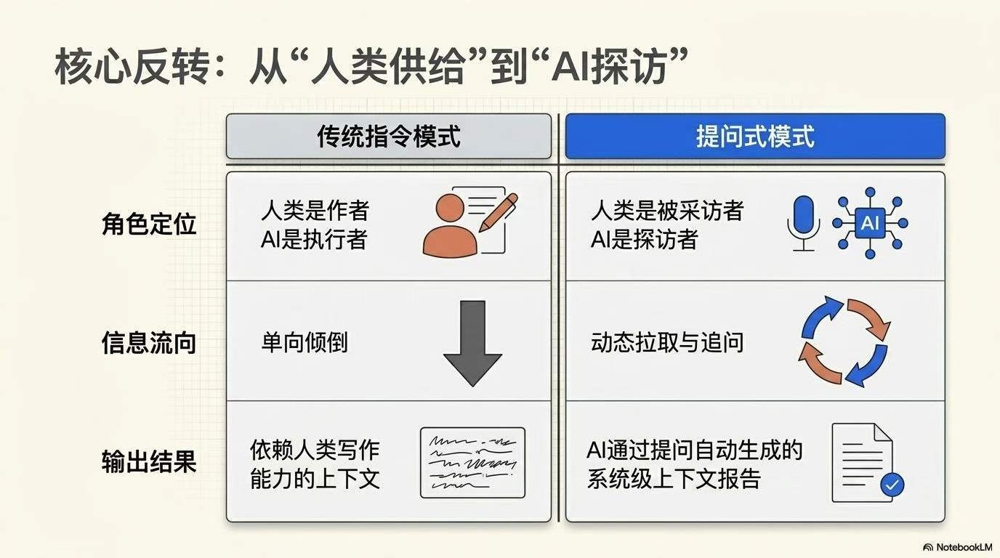
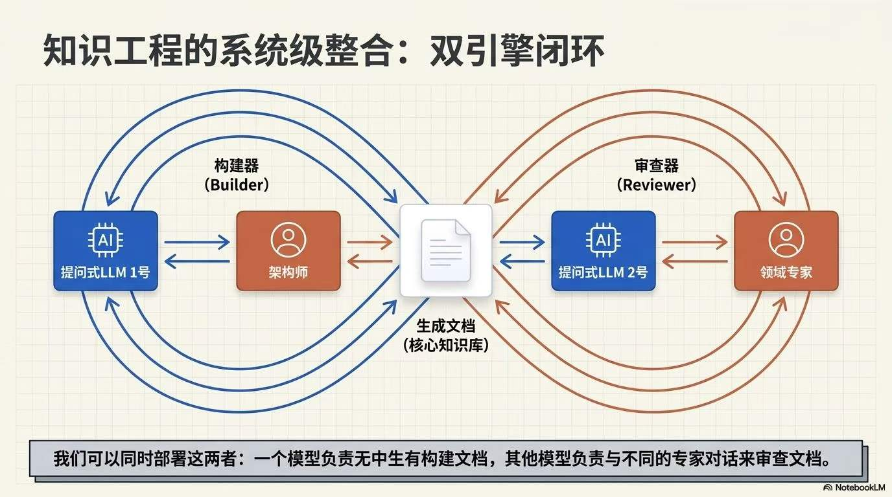
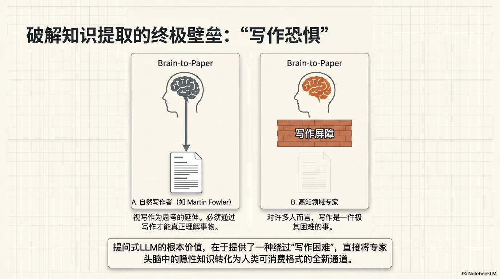
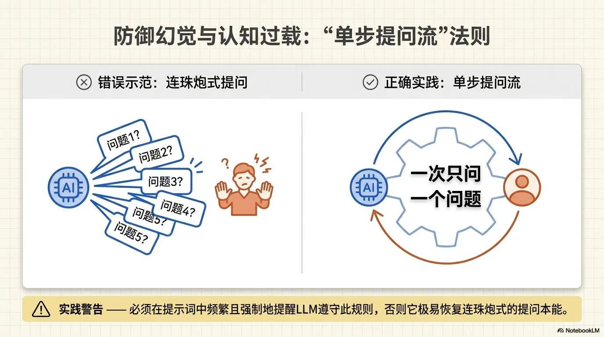
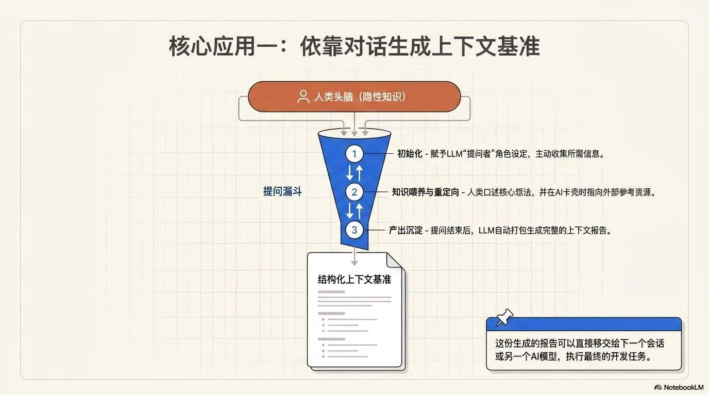

很多人第一次用 LLM 写代码时，都会直接说：“帮我做一个应用。”结果通常并不稳定：代码能生成，但需求被猜错，边界没说清，测试也缺失。

问题往往不在于 LLM 不会写，而在于它还不知道该写什么。

当我们希望 LLM 完成一个复杂任务时，通常需要给它很多上下文。比如，要设计一个新功能，就得说明用户会怎样使用它、功能应该如何实现、有哪些外部系统需要参考、数据如何处理、错误如何兜底、测试应该覆盖什么。

把这些信息写清楚，常常就是好几页 Markdown。


## 让 LLM 成为采访者

最直接的做法，当然是由人来写这份上下文。但还有另一种做法：**让 LLM 先来采访人。**



不是一上来就让它生成方案，也不是马上让它写代码。

相反，你要求它反过来提问：它需要什么信息，就问什么问题；它不确定的地方，就继续追问；需要外部资料时，就告诉它该参考哪些来源。

等访谈结束后，再由它把结果整理成一份上下文报告，交给另一个会话、另一个模型，或者开发者继续执行。

Martin Fowler 把这种用法称为 **Interrogatory LLM**。可以理解为“访谈式 LLM”或“追问式 LLM”。

这个模式的重点不在于让 LLM 直接给答案，而在于让它通过提问，把人脑里的隐性知识挖出来，并转成可执行、可审阅、可传递的文档。

Fowler 提到，他最早是在 Harper Reed 的文章里看到这种方法的清晰描述。Harper 的一个关键要求是：

> 每次只让 LLM 问一个问题。

这个细节很重要。

一次抛出十几个问题，看似高效，实际很容易让人疲惫，也容易让回答变得敷衍。一次一个问题，则更像一次真正的访谈：上一个回答会影响下一个问题，思路可以逐步展开。



这种方法不仅可以用来生成文档，也可以反过来检查文档。

比如，你已经有一份软件规格说明，它记录了某个业务领域的知识。与其让领域专家从头到尾读一遍并审稿，不如让 LLM 读完文档后去采访专家：

- 哪里可能不准确？
- 哪里缺了前提？
- 哪些术语需要澄清？
- 哪些流程和现实不符？

很多人并不擅长审文档，尤其是文档写得不够好时。相比被动阅读，一场由 LLM 主持的对话，可能更容易把专家脑子里的判断引出来。



我们甚至可以连续使用这两种方式：先让一个访谈式 LLM 根据人的回答生成文档，再让另一个访谈式 LLM 拿这份文档去采访其他专家，检查它是否准确。

这件事也不只适用于软件。

Fowler 说，他自己是一个通过写作来思考的人：要真正理解某件事，他需要把它写下来。但并不是每个人都这样。很多人写作很困难，甚至非常困难。

可在组织里，我们常常需要把某个人脑子里的知识变成其他人能理解、能使用的材料。对这些人来说，让 LLM 采访自己，可能比自己坐下来写一篇文档更容易。



哪怕最终文本带着一点 AI 写作的味道，也总比没有信息、或者只有一份仓促写出的、不够清楚的文档要好。



## 从想法到 spec.md

Harper Reed 的文章把这个想法推进到了代码生成实践里。

他的经验可以概括为一句话：

> 先用头脑风暴打磨规范，再把实现计划拆到足够小，最后让 LLM 按离散的小循环一步步写代码。

他把开发场景分成两类：

1. 全新项目；
2. 已经存在、但仍需要持续迭代的代码库。

对全新项目，第一步不是打开编辑器，而是把想法交给一个对话式 LLM，让它帮你追问清楚。

他常用的提示词大意是：

```text
请一次只问我一个问题，帮助我把这个想法发展成一份完整、循序渐进的规格说明。

每个问题都应该基于我之前的回答。

我们的目标是得到一份可以交给开发者的详细规范。

请迭代推进，挖出所有相关细节。

记住，一次只问一个问题。
```

当头脑风暴自然结束后，再让模型把所有发现整理成完整的开发者规格说明，包括需求、架构选择、数据处理、错误处理策略和测试计划。

Harper 通常会把这份文档保存为 `spec.md`。

这份 `spec.md` 不只是为了代码生成。它也可以继续交给推理模型去检查漏洞、深化思路、生成商业模型、做研究，甚至写出更长的分析报告。

关键是，有了 `spec.md`，想法就不再只是脑子里的一团模糊愿望，而变成了可以讨论、可以拆解、可以执行的材料。

## 从 spec.md 到 prompt_plan.md

第二步是规划。

Harper 会把 `spec.md` 交给推理能力更强的模型，让它先制定详细蓝图，然后不断把蓝图拆小：先拆成小块，再把小块继续拆成更小的步骤，直到每一步都小到可以安全实现、方便测试，同时又大到足以推动项目前进。

如果采用 TDD，他会要求模型把每一步设计成适合测试驱动开发的提示词。每个提示词都应该建立在前一个提示词之上，最后要把东西接起来，不能留下没有集成的孤立代码。

规划的目标，不只是列任务，而是产出一组可以逐条交给代码生成 LLM 执行的提示词。

Harper 会把这份结果保存为 `prompt_plan.md`。

接着，他还会让模型生成一个 `todo.md`，作为执行过程中的检查清单。最好让代码生成工具在推进时自动勾选它，这样即使跨会话，也能知道项目走到哪里。

到这里，真正的代码还没开始写，但最关键的事情已经完成了：

- 你有了规格说明；
- 有了实施计划；
- 有了执行提示词；
- 有了进度清单。

Harper 说，整套准备流程大概十五分钟左右。

## 真正开始写代码

第三步才是执行。

执行工具可以很多：Claude、Aider、Cursor、GitHub Workspace、Sweep、ChatGPT 等都可以。Harper 的观点是，成败很大程度上取决于前面的规划质量，而不是某一个工具本身。

如果使用 Claude，他的流程大致是：

1. 先初始化仓库和基础工具链，比如脚手架、`uv init`、`cargo init` 等；
2. 把第一条实现提示词交给 Claude；
3. 把输出放进 IDE；
4. 运行代码或测试；
5. 如果通过，就继续下一条；
6. 如果失败，就把代码库上下文打包后交给 Claude 调试；
7. 如此循环。

如果使用 Aider，流程类似，只是 Aider 能直接修改文件、运行命令并汇报结果。

你启动 Aider，把计划里的提示词逐条喂给它，看它修改代码、跑测试、尝试修复。

测试在这个流程里非常重要：当工具能自动改代码时，测试就是维持边界和健康度的护栏。

Harper 用这套方法做过脚本、Expo App、Rust CLI 等项目，跨语言、跨场景都能运转。它特别适合那些你一直拖着没做的小产品：只要先把想法问清楚，再按计划推进，项目会比想象中更快动起来。

## 已有代码库怎么办

面对已有代码库时，做法会有所变化。

你通常不需要一次性规划整个项目，而是围绕某个具体任务或改进点逐步规划。关键是把代码库上下文高效交给 LLM。

Harper 使用 `repomix` 把仓库内容打包成 `output.txt`，再配合 LLM 命令生成代码审查、GitHub issue、缺失测试清单、README 等文档。如果 token 超限，就通过忽略规则剔除无关内容。

例如，如果他想补测试，就会先让工具根据代码库生成 `missing-tests.md`，然后把上下文和第一条缺失测试任务交给 Claude 或 Aider，生成代码，运行测试，再进入下一条。

这样就能在大型代码库里进行小步快跑，而不是让 LLM 一次性改一大片。

Harper 还分享了几类常用提示词：

- 让 LLM 做资深开发者式的代码审查；
- 生成具体、可执行的 GitHub issues；
- 找出缺失测试。

他也承认这些提示词有些“老派”，但在实践里很有效。

## 速度越快，越需要护栏

不过，这套流程最大的风险也来自它的高效。

Harper 用滑雪来比喻这种状态：滑得太快，身体已经跟不上雪板。用 LLM 编程也一样，很容易快到超出自己的控制能力。

刚开始你可能还觉得自己在粉雪上顺滑前进，下一秒就会突然不知道发生了什么，然后掉进悬崖。

这正是为什么规划和测试如此重要。

全新项目里，规划能让你始终有文档可以对照；测试能确保每一步修改都没有把系统带偏。即便如此，失控仍然会发生。

遇到这种情况，Harper 的建议很朴素：站起来走走，换个思路，重新聚焦。

说到底，这仍然是普通的问题解决，只是节奏被 LLM 加速了。

他还提到一个遗憾：现有的 LLM 编程流程大多仍是单人模式。

虽然他也有独立开发、结对和团队协作的经验，但当前的 bot 容易互相冲突，分支合并困难，上下文同步麻烦。他希望未来有人能把 LLM 编程做成真正的多人协作体验，而不只是孤独黑客的单机游戏。

## 这不是替代软件工程

把 Fowler 和 Harper 放在一起看，可以得到一个清晰的结论：

**高质量使用 LLM，并不是一开始就让它写答案，而是先让它帮助我们生成上下文。**

Fowler 给这个模式命名：让 LLM 采访人，提取知识，生成或校验文档。

Harper 则展示了它在代码生成中的完整落地：先访谈，后成文；先规划，再执行；每一步都要小、要接得上、要能验证。

如果把它压缩成一个工作流，就是：

1. 让 LLM 一次只问一个问题，采访你；
2. 把访谈结果整理成开发者可用的 spec；
3. 用推理模型把 spec 拆成小而连续的执行步骤；
4. 把步骤逐条交给代码生成工具；
5. 每一步都运行测试或做人工验证；
6. 必要时再让 LLM 审查文档或代码。

这不是抛弃软件工程，而是把软件工程里那些容易被跳过的环节——需求澄清、规格说明、任务拆解、测试计划、代码审查——变得更容易执行。

也许最值得记住的是：

> LLM 不是只会写代码的打字机。用得好，它更像一个会追问的助手，先帮你把脑子里的东西问出来，再把它整理成别人也能理解、工具也能执行的上下文。

所以，下次不要急着说：

```text
帮我写一个应用。
```

可以先试着说：

```text
请一次只问我一个问题，直到你能写出一份完整的开发规范。
```

很多时候，真正的魔法不是 LLM 写出了代码，而是它先帮你想清楚了要写什么。
